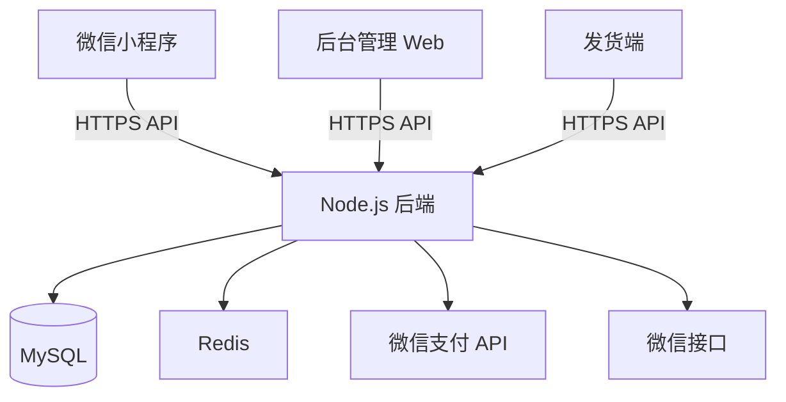

## 产品概述

一个完整的花店微信小程序商城系统，包含客户端小程序、后台管理系统和发货端。基于开源商城项目二次开发，定制为花店业务场景。

## 核心功能

### 客户端小程序

- 商品浏览：鲜花、花束、绿植等分类展示，支持搜索和筛选
- 商品详情：多规格选择、鲜花寓意描述、保养说明
- 购物车：添加、删除、数量修改、批量结算
- 下单支付：微信支付、收货地址管理、订单备注、定时配送
- 个人中心：订单管理（待付款/待发货/待收货/已完成）、优惠券、会员积分

### 后台管理系统（Web）

- 商品管理：商品上下架、分类管理、库存管理、价格设置
- 订单管理：订单列表、订单详情、发货处理、退款处理
- 用户管理：用户列表、会员等级、积分管理
- 营销管理：优惠券发放、秒杀活动配置
- 数据统计：销售数据、订单统计

### 发货端

- 订单处理：待发货订单列表、扫码发货、批量打印发货单
- 订单状态管理：已发货、配送中、已完成状态更新

### 营销功能

- 优惠券：满减券、折扣券、新人券
- 秒杀活动：限时特价鲜花
- 会员积分：消费积分、积分兑换

## 技术栈选型

### 推荐开源项目

**EastWorld/wechat-app-mall**

- 仓库地址：https://github.com/EastWorld/wechat-app-mall
- 特点：长期维护的微信小程序商城，基于 Vant Weapp 组件库
- 协议：MIT 开源，可自由二次开发

### 技术架构

- **小程序前端**：微信小程序原生 + Vant Weapp 组件库（基于开源项目）
- **后端服务**：Node.js + Express + MySQL + Redis
- **后台管理**：Vue3 + Element Plus
- **部署**：Nginx 反向代理 + PM2 进程管理

### 系统架构设计



### 目录结构设计

```
d:/Github/Flora/
├── flora-miniprogram/          # 微信小程序（基于wechat-app-mall）
│   ├── pages/
│   │   ├── index/             # 首页
│   │   ├── category/          # 分类页
│   │   ├── goods-detail/      # 商品详情
│   │   ├── cart/              # 购物车
│   │   ├── order/             # 订单相关
│   │   ├── user/              # 个人中心
│   │   └── coupon/            # 优惠券
│   ├── components/            # 组件
│   ├── api/                   # API封装
│   └── app.json
├── flora-server/              # Node.js后端
│   ├── src/
│   │   ├── controllers/       # 控制器
│   │   ├── models/            # 数据模型
│   │   ├── routes/            # 路由
│   │   ├── middleware/        # 中间件
│   │   └── utils/             # 工具函数
│   └── package.json
├── flora-admin/               # 后台管理（Vue3）
│   ├── src/
│   │   ├── views/             # 页面
│   │   ├── api/               # API
│   │   └── components/       # 组件
│   └── package.json
└── docs/
    ├── deployment.md          # 部署指南
    └── setup-guide.md         # 从零配置指南
```

### 数据库核心表设计

- `users` - 用户（openid、昵称、手机号、积分）
- `goods` - 商品（名称、分类、价格、库存、图片）
- `orders` - 订单（订单号、用户ID、金额、状态）
- `cart` - 购物车
- `coupons` - 优惠券
- `seckill` - 秒杀活动

### 微信生态对接

- 微信登录（wx.login 获取 openid）
- 微信支付（统一下单、支付通知）
- 微信订阅消息（订单状态通知）

### 从零配置指南

1. **申请微信小程序 AppID**：

- 访问 mp.weixin.qq.com 注册小程序账号
- 个人可注册（无法使用微信支付）
- 企业注册需认证（可使用微信支付）

2. **服务器准备**：

- 推荐腾讯云（与微信集成好）
- 需要：云服务器、域名（已备案）、SSL证书

3. **开发环境**：

- 安装微信开发者工具
- 安装 Node.js、MySQL、Nginx

## 设计风格

花店小程序采用清新优雅的自然风格，以鲜花美感为核心，打造温馨精致的购物体验。

## 色彩方案

- 主色调：薄荷绿 #4CAF50、玫瑰粉 #E91E63
- 背景色：奶油白 #FFF8E1、纯白 #FFFFFF
- 文字色：深灰 #333333、中灰 #666666
- 功能色：红色（错误）#FF5252、绿色（成功）#4CAF50

## 页面设计（5个核心页面）

### 1. 首页

- 顶部搜索栏：圆角输入框，鲜花图标
- 轮播图区：花卉海报，圆角卡片风格
- 分类导航：5个图标（鲜花/花束/绿植/礼品/永生花）
- 秒杀专区：倒计时 + 横向滑动商品卡
- 精选推荐：双列瀑布流布局
- 配色：薄荷绿为主，白色背景

### 2. 分类页

- 左侧分类栏：浅绿背景，选中项绿色左边框
- 右侧商品区：网格布局，商品卡片带花卉边框装饰
- 顶部筛选栏：综合/销量/价格排序

### 3. 商品详情页

- 图片轮播：圆角卡片，支持预览大图
- 商品信息：名称、价格（红色强调）、销量
- 规格选择：弹窗式选择器，花语寓意展示
- 详情区：保养说明、配送说明，图文并茂
- 底部操作栏：加入购物车（绿色）、立即购买（粉色）

### 4. 购物车页

- 商品列表：左滑删除，数量步进器
- 优惠券入口：显示可用券数量
- 底部结算：合计金额、去结算按钮（绿色渐变）

### 5. 个人中心

- 用户信息区：圆形头像、昵称、会员徽章（金色）
- 订单状态：4个状态入口，带红点提示
- 功能菜单：地址管理、优惠券、积分、客服
- 背景：浅绿渐变顶部，白色卡片内容区

## 后台管理系统

- 侧边栏：薄荷绿主题，白色图标
- 内容区：白色背景，表格带浅绿悬停效果
- 按钮：绿色主按钮，红色危险按钮

## Agent 扩展使用

### SubAgent

- **code-explorer**
- 用途：探索 wechat-app-mall 开源项目的代码结构和架构模式
- 预期结果：理解项目组织方式，确定二次开发的最佳实践